# Database Project

**Submitted by:** Harel Gabay  
**Subject:** MDA Logistics 

---

## Table of Contents
1. [Phase 1](#phase-1)
   * [Project Overview](#project-overview)
   * [Google Ai Studio](#google-ai-studio)
   * [Entity Relationship Diagram (ERD)](#entity-relationship-diagram-erd)
   * [Data Structure Diagram (DSD)](#data-structure-diagram-dsd)
   * [SQL Scripts](#sql-scripts)
   * [Data Insertion](#data-insertion)
   * [Backup Process](#backup-process)
2. [Phase 2](#phase-2)
   * [Queries](#queries)
     - [Select Queries](#select-queries)
     - [Update Queries](#update-queries)
     - [Delete Queries](#delete-queries)
   * [Rollback and Commit](#rollback-and-commit)
   * [Constraints](#constraints)
   * [Indexes](#indexes)
---

## Phase 1

### Project Overview
The project manages the complex logistics of an MDA organization, focusing on operational readiness—tracking stations, personnel, fleet maintenance, and inventory without handling private medical records.

#### Purpose of the Database
The primary goals of this project are:
* **Database Design**: Creating a well-structured relational database normalized to 3NF.
* **Efficient Data Storage**: Organizing data to allow quick retrieval and manipulation.
* **Data Integrity and Consistency**: Implementing constraints (PK, FK, Check) to maintain valid data.
* **Backup and Recovery**: Ensuring that data is not lost and can be restored when needed.

#### Key Functionalities
* **Data storage and retrieval** using advanced SQL queries.
* **Relationships between tables** ensuring logical connections and referential integrity.
* **Simulating real-world scenarios** where database management is crucial for life-saving logistics.
* **Automation of data entry** using external Python scripts and bulk injection tools.

### Google Ai Studio
* **Live Website:** [MDA Logistics](https://ems-logistics-pro-505350528104.us-west1.run.app/)

1. **Main Dashboard**: Overview of active vehicles and logistical activities. 
2. **Inventory & Procurement**: Management of station inventory and purchase orders. 
3. **Fleet Management**: Tracking of ambulance fleet details and garage logs. 
4. **Compliance & Tracking**: Sensitive tracking for equipment calibration and substances. 
5. **Personnel & Gear**: Directory of medical staff and gear logs. 

### Entity Relationship Diagram (ERD)
The conceptual data model mapping out 12 core entities and their relationships.

### Data Structure Diagram (DSD)
The logical database schema normalized to **3NF**, including PK/FK mappings.

### SQL Scripts
**The following SQL scripts are included in the repository:**

* **Create Tables:** Defines the database schema.
* [📜 View](./Phase_1/Sql_commands/createTables.sql)
* **Insert Data:** Populates the tables with sample data.
* [📜 View](./Phase_1/Sql_commands/insertTables.sql)
* **Drop Tables:** Removes all tables from the database.
* [📜 View](./Phase_1/Sql_commands/dropTables.sql)
* **Select All Data:** Retrieves all data from the tables.
* [📜 View](./Phase_1/Sql_commands/selectAll.sql)

### Data Insertion

#### 1. Phase A: Manual Baseline
Small-scale, high-quality manual insertions were performed to verify schema constraints and relationship integrity.
* **File:** [insertTables.sql](./Phase_1/sql_commands/insertTables.sql)

#### 2. Phase B: Institutional Scaling (500+ Records)
To reach a realistic scale for a national EMS organization, a Python-based generator was developed using the **Faker** library. This phase populated 9 core tables with over **500 records each**.
* **Methodology**: Uses an idempotent approach with `ON CONFLICT DO NOTHING` to allow repeatable generation without collisions.
* **Script:** [generate_sql.py](./Phase_1/Programming/generate_sql.py)

#### 3. Phase C: Bulk Injection (40,000+ Records)
Simulating years of operational history, we injected **20,000 records each** into `Maintenance_Log` and `Controlled_Substances_Log`.
* **Mock Data Generation (Mockaroo)**: Used to generate random CSV files for data insertion.

* **Bulk Loading**: Utilizes the PostgreSQL **COPY** command for high-speed injection, bypassing standard INSERT overhead.
* **Script:** [insert_to_db.py](./Phase_1/mockarooFiles/insert_to_db.py)

Final state of tables:

### Backup Process
The backup was generated using the **pgAdmin 4** management interface. We fully restored it on a fresh container to ensure data portability.

* **File:** [backup_23_03_2026.sql](./Phase_1/backup_23_03_2026.sql)

---

## **Phase 2**
### Queries

#### Select Queries:
**1. ספקים שלא ביצעו הזמנות משנת 2025**

הסבר יעילות: תצורה 1 (NOT EXISTS) מומלצת כי היא עוצרת מיד כשנמצאת התאמה. תצורה 2 (LEFT JOIN) מאלצת לבצע חיבור מלא של הטבלאות בזיכרון ורק אז מסננת ערכי NULL.

**2. עובדים שמשכו חומרים נרקוטים בחודש נובמבר 2025**

הסבר יעילות: תצורה 1 (IN) עדיפה כי היא בודקת רק קיום של רשומה. תצורה 2 (JOIN) משכפלת רשומות ומאלצת שימוש ב-DISTINCT, המצריך פעולת מיון (Sort) שגוזלת משאבים רבים.

**3. פריטי ציוד רפואי שהכמות שלהם במלאי קטנה מ-10**

הסבר יעילות: תצורה 1 (JOIN) הרבה יותר יעילה. תצורה 2 מריצה תתי-שאילתות בשורת ה-SELECT עבור כל שורה שמוחזרת (בעיית N+1), מה שמאט מאוד את זמן הריצה.

**4. רכבים שעלות הטיפולים שלהם גבוהה מהממוצע הארצי**

הסבר יעילות: תצורה 1 (WITH - CTE) מחשבת את הממוצע הארצי פעם אחת בלבד ושומרת אותו בזיכרון. לכן היא קריאה ויעילה יותר לעומת תצורה 2 שמחשבת זאת מחדש בתוך ה-HAVING.

**5. דוח עלויות טיפולי מוסך מקובץ לפי תחנה וחודש**

**6. היסטוריית חלוקת מדים - מנפק מול מקבל**

**7. ציוד כיול שחזר עם סטטוס כשלון, מספר כישלונות, ותאריך אחרון לפי תחנה**

**8. הזמנות רכש פתוחות טרם סופקו וכמות הפריטים שהוזמנה**

#### Update Queries

##### **1 – עדכון כמות מלאי לציוד רפואי בתחנות ירושלים**
שאילתא זו מגדילה ב־10% את כמות המלאי של פריטים רפואיים בתחנות הממוקמות בעיר ירושלים.

לפני:
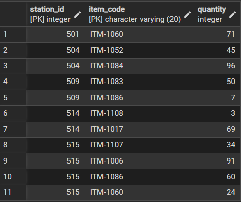

אחרי:
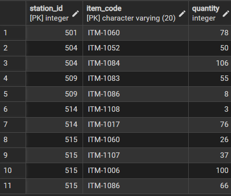

##### **2 – עדכון שיוך רכבים ישנים לתחנה 500**
שאילתא זו מעבירה רכבים שיוצרו לפני שנת 2020 מסוג ALS Ambulance או MICU לתחנה מספר 500.

לפני:
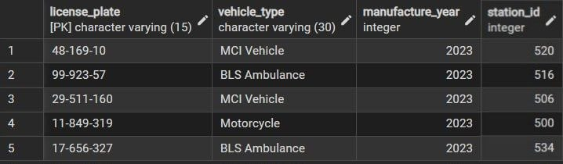

אחרי:
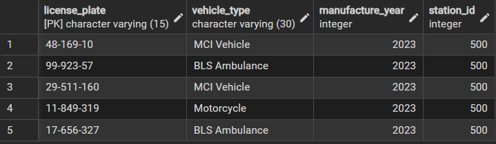

##### **3 – דחיית תאריך אספקה להזמנות מספק 101**
שאילתא זו דוחה ב־5 ימים את תאריך האספקה של הזמנות מספק מספר 101 אשר טרם סופקו.

לפני:
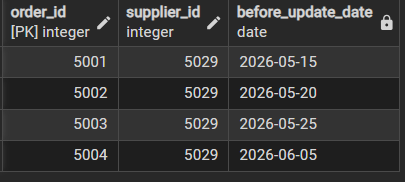

אחרי:
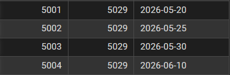

#### Delete Queries

##### **1 – מחיקת לוגים ישנים של ציוד כיול**
שאילתא זו מוחקת רשומות של בדיקות כיול שעברו בהצלחה ובוצעו לפני יותר מ־5 שנים.

לפני:
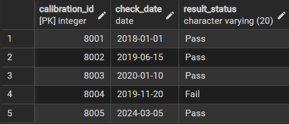

אחרי:
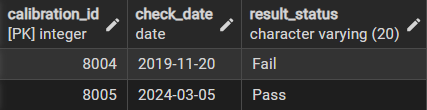

##### **2 – מחיקת טיפולים זולים לפני שנת 2020**
שאילתא זו מוחקת טיפולי מוסך בעלות נמוכה מ־100 ש"ח שבוצעו לפני שנת 2020.

לפני:
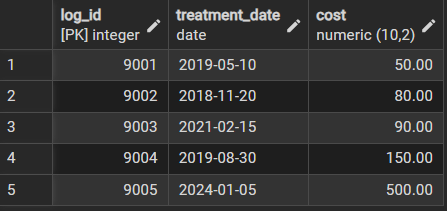

אחרי:
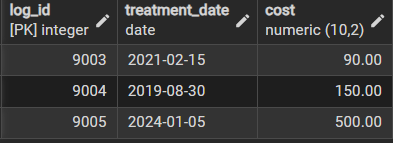

##### **3 – מחיקת טיפולים זולים לרכבים בירושלים**
שאילתא זו מוחקת טיפולי מוסך בעלות נמוכה מ־100 ש"ח שבוצעו על רכבים המשויכים לתחנות בעיר ירושלים.

לפני:
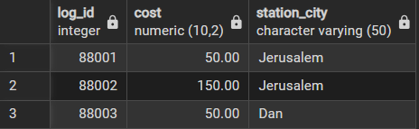

אחרי:
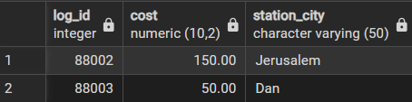

### Rollback and Commit
[Code Rollback and Commit](/Phase_2/RollbackCommit.sql)

#### Rollback
**איפוס כמות ממוצר בתחנה**

לפני:

אחרי:

ביצוע ROLLBACK:
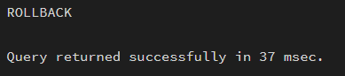

אחרי:

#### Commit
**שינוי תפקיד לעובד**

לפני:

אחרי:

ביצוע COMMIT:

אחרי:

### Constraints
[Code Of Constraints](/Phase_2/constraints.sql)

#### **אילוץ ראשון:** כל אמייל חייב להכיל @ בתוכו
הקוד שניסינו להריץ:

מישום שזה נוגד לאילוץ קיבלנו את השגיאה הבאה:

#### **אילוץ שני:** הגבלת כמות האפשרית למשיכה של חומרים רגישיים בפעם אחת ל 50
הקוד שניסינו להריץ:
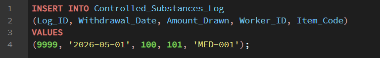

מישום שזה נוגד לאילוץ קיבלנו את השגיאה הבאה:

#### **אילוץ שלישי:** שנת ייצור של רכב חייבת להיות קטנה או שווה לשנת רכישה
הקוד שניסינו להריץ:
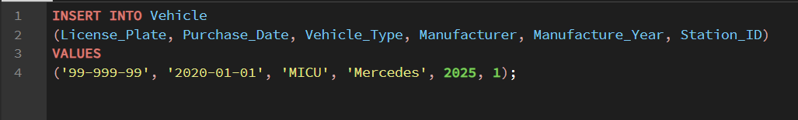

מישום שזה נוגד לאילוץ קיבלנו את השגיאה הבאה:

### Indexes
#### **אינדקס ראשון על תאריך טיפול (Maintenance_Log):** 
לפני:

אחרי:

#### **אינדקס שני על ת.ז עובד (Maintenance_Log):** 
לפני:

אחרי:

#### **אינדקס שלישי על קוד פריט רגיש במשיכות (Controlled_Substances_Log):** 
לפני:

אחרי:

#### **הסבר לתוצאות:**
לפני הוספת האינדקסים, מסד הנתונים נאלץ לבצע סריקה מלאה של כל 20,000 השורות בטבלה כדי למצוא את הנתונים המבוקשים (פעולה המכונה Full Table Scan), מה שלקח זמן רב יותר. לאחר יצירת האינדקסים, מסד הנתונים השתמש במבנה נתונים ממוין (B-Tree) המאפשר "קפיצה" ישירה לנתונים הרלוונטיים (Index Seek), וכתוצאה מכך זמן הריצה התקצר משמעותית לאלפיות שנייה בודדות.

* **File:** [backup_03_05_2026.sql](./Phase_2/backup_03_05_2026.sql)

## שלב ג' – אינטגרציית בסיסי נתונים ומבטים מתקדמים

## 1. תרשימי ה-ERD וה-DSD המעודכנים

### 1.1 תרשים קונספטואלי (ERD)
מציג את ישות האם `Personnel` ואת קשר ההורשה (IS-A) המתפצל לישויות הבנות `Drivers` ו-`Volunteers` (ביחס של 1:1). בנוסף, מוצגת ישות `Emergency_Dispatches` (שיגורים) המקושרת לנהג ולרכב, ואת קשר הרבים-לרבים (M:N) `Crew_Of` בין מתנדבים לשיגורים.

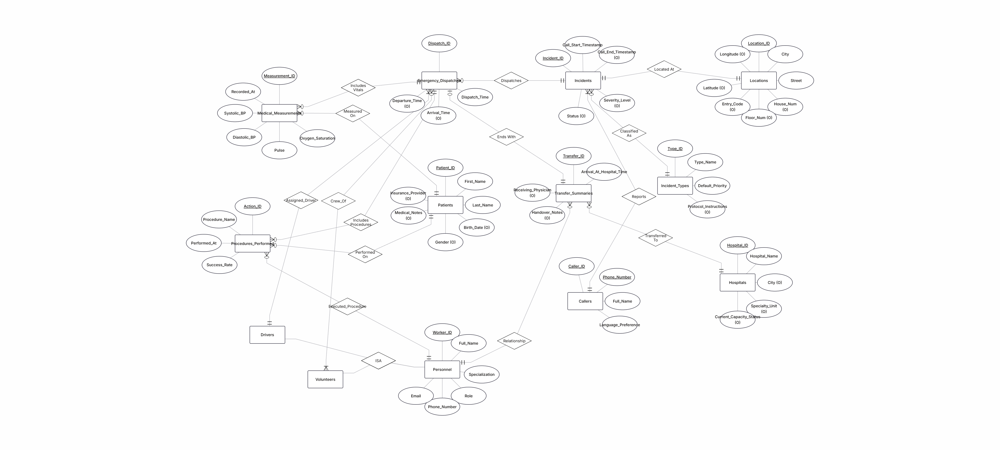

### 1.2 תרשים מבני / סכמה רלציונית (DSD)
מציג את הטבלאות הפיזיות, מפתחות ראשיים (PK) ומפתחות זרים (FK). בתרשים זה ניתן לראות את טבלת הגישור הפיזית `dispatch_volunteers` המכילה מפתח ראשי מורכב, וכן את הקישורים הישירים מטבלאות הרכש, המדים והמוסך אל טבלת האם `personnel`.

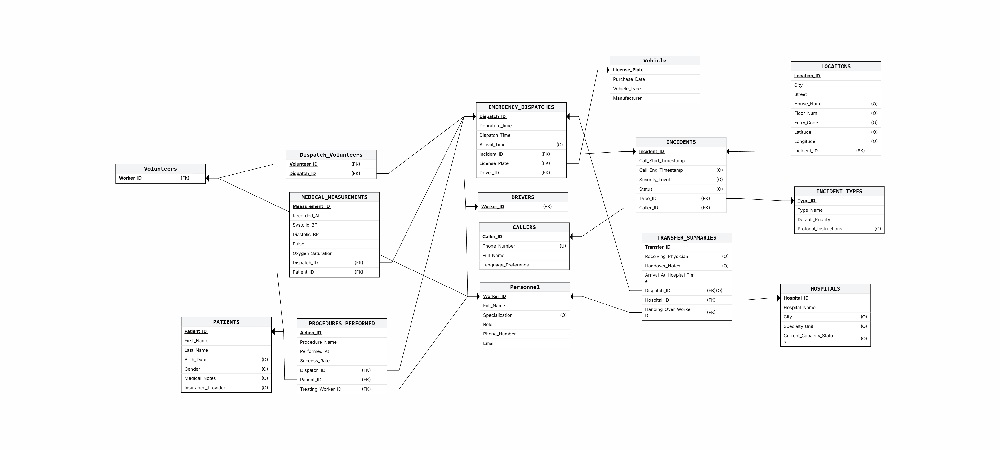

---

## 2. החלטות שנעשו בשלב האינטגרציה

במהלך מיזוג המערכת המבצעית-רפואית עם המערכת הלוגיסטית ומערכת משאבי האנוש, התמודדנו עם אתגר ארכיטקטוני מורכב: כיצד להחיל חוקים מבצעיים נוקשים על אנשי הצוות מבלי לפגוע בשלמות הנתונים של המערכת הלוגיסטית (שבה כלל אנשי הצוות מבצעים פעולות רכש, ניפוק מדים או טיפול ברכבים).

להלן ההחלטות ההנדסיות המרכזיות שנתקבלו:

1. **אימוץ מודל הכללה והתמחות (Supertype / Subtype):** הוחלט לשמר את טבלת `personnel` המקורית כטבלת אב (Supertype). היא מרכזת את הפרטים האישיים והשיוך התחנתי של כלל העובדים בארגון. תחתיה, הוקמו שתי טבלאות בנות – `drivers` ו-`volunteers` – המקושרות אליה בקשר ירושה (1:1). החלטה זו מנעה כפילות נתונים (Data Redundancy) ושמרה על שלמות מוחלטת של כל קשרי הלוגיסטיקה הקיימים.
2. **ייצוג קשר רבים-לרבים לצוותי המשימה:** באמבולנס יחיד משובץ נהג אחד בדיוק, אך מספר משתנה של מתנדבים. כדי לאפשר שיבוץ דינמי זה תוך שמירה על נרמול, הוקמה טבלת גישור ייעודית בשם `dispatch_volunteers`.
3. **העברת אכיפת החוקים העסקיים לרמת מסד הנתונים (Triggers):** הוחלט לנעול את החוקים המבצעיים באמצעות טריגרים הרצים לפני פעולות הוספה או עדכון, כגון:
    * **טריגר אימות נוכחות בצוות:** מונע רישום של איש צוות כמבצע פעולה רפואית בשטח, אלא אם המערכת מאמתת שהוא שובץ פיזית באמבולנס הספציפי שייצא לאירוע.
    * **טריגר סמכות מסירה למיון:** חוסם כל ניסיון לחתום על טופס העברת מטופל לבית חולים, אלא אם החותם הוא הנהג המוגדר של אותה הנסיעה.
4. **פתרון בעיית אופטימיזציית ההגרלה ב-PostgreSQL:** כדי להבטיח פיזור אקראי אמיתי של שיבוץ רכבים ונהגים לכל נסיעה (ולמנוע שיוך של אותו רכב לכל הנסיעות בבת אחת בשל אופטימיזציית מנוע), השתמשנו בהמרת עמודות למערכים דינמיים ושליפת אינדקס אקראי המחושב מחדש אקטיבית לכל שורת נתונים בנפרד.

---

## 3. הסבר מילולי של התהליך והפקודות

תהליך המיזוג והחלת הארכיטקטורה החדשה בוצע במספר פעימות של שאילתות ופעולות על בסיס הנתונים:

* **שלב א' - פיצול ישויות (Subtypes):** יצרנו את טבלאות הנהגים והמתנדבים. הנתונים נשאבו לתוכן מתוך טבלת `personnel` המקורית באמצעות חיתוך טקסטואלי על שדה התפקיד, תוך הגדרת מפתח ראשי המהווה גם מפתח זר לטבלת האם עם חוק מחיקה מדורגת.
* **שלב ב' - הרחבת התשתיות:** הוספנו את עמודות הקישור הנדרשות לטבלאות המבצעיות (כגון שדה מזהה נהג או לוחית רישוי בטבלת השיגורים), ויצרנו פיזית את טבלת הגישור של המתנדבים עם מפתח ראשי מורכב למניעת כפילויות שיבוץ באותה נסיעה.
* **שלב ג' - סימולציה ויישור נתונים לוגי (Data Alignment):** ביצענו עדכון גורף לשיבוץ רנדומלי של רכבים ונהגים חוקיים לכל משימה. בנוסף, סינכרנו את הזמנים כך שזמני ההגעה והעזיבה יהיו כרונולוגיים והגיוניים לזמן הקריאה, ודאגנו להתאמה גיאוגרפית של בית החולים הקולט. להגרלת המתנדבים השתמשנו בלולאת הצלבה מתקדמת.
* **שלב ד' - החלת אילוצי שלמות (Constraints):** הוגדרו המפתחות הזרים הפיזיים אשר חוסמים הזנת רשומות ללא סימוכין (למשל, שיגור רכב שאינו קיים במצבת הרכבים או נהג שלא קיים בטבלת נהגים).
* **שלב ה' - פיתוח טריגרים (Triggers):** נכתבו פונקציות אכיפה אשר בודקות תנאים לוגיים המאחדים את צוות הנהגים והמתנדבים בנסיעה ספציפית, וזורקות שגיאה חמורה העוצרת את התהליך במידה ויש ניסיון להזין נתון המפר את נוהלי הארגון.

---

## 4. תיאור מילולי של המבטים ושליפת נתונים בסיסית

### מבט 1: אגף משאבי אנוש ולוגיסטיקה (`hr_personnel_deployment_view`)
**תיאור מילולי:** מבט ניהולי המחבר בין טבלת האם של העובדים לטבלת התחנות, ומבצע בדיקה דינמית מול טבלאות הבנות כדי לקבוע באופן מילולי האם העובד מתפקד בארגון כנהג ('Driver') או כמתנדב ('Volunteer'). המבט חוסך למנהל כוח האדם את הצורך לבצע תתי-שאילתות מורכבות בעת הפקת דוח מצבת עובדים.

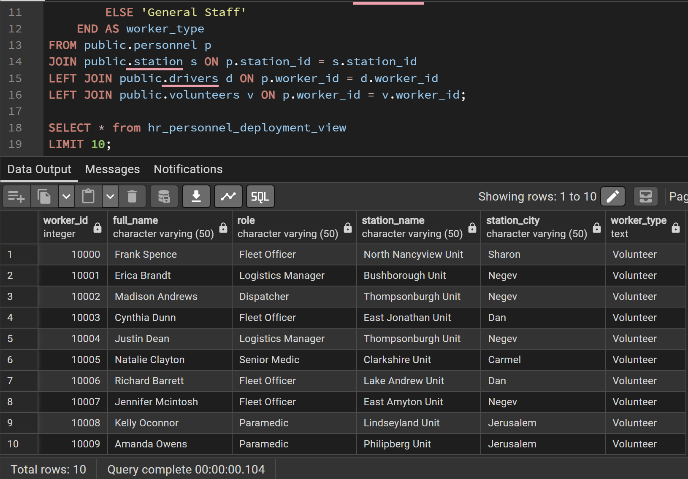

---

### מבט 2: האגף המבצעי-רפואי (`medical_procedures_tracking_view`)
**תיאור מילולי:** מבט המיועד לבקרת איכות רפואית. הוא משלב נתונים מטבלת הטיפולים הרפואיים בשטח, טבלת נסיעות החירום, טבלת האירועים המרכזית וטבלת העובדים. המבט מציג תמונה אחודה הכוללת את שם הטיפול, אחוז ההצלחה, רמת החומרה, וסוג המקרה, לצד שמו המלא של איש הצוות שביצע את הטיפול בפועל (נהג או מתנדב).

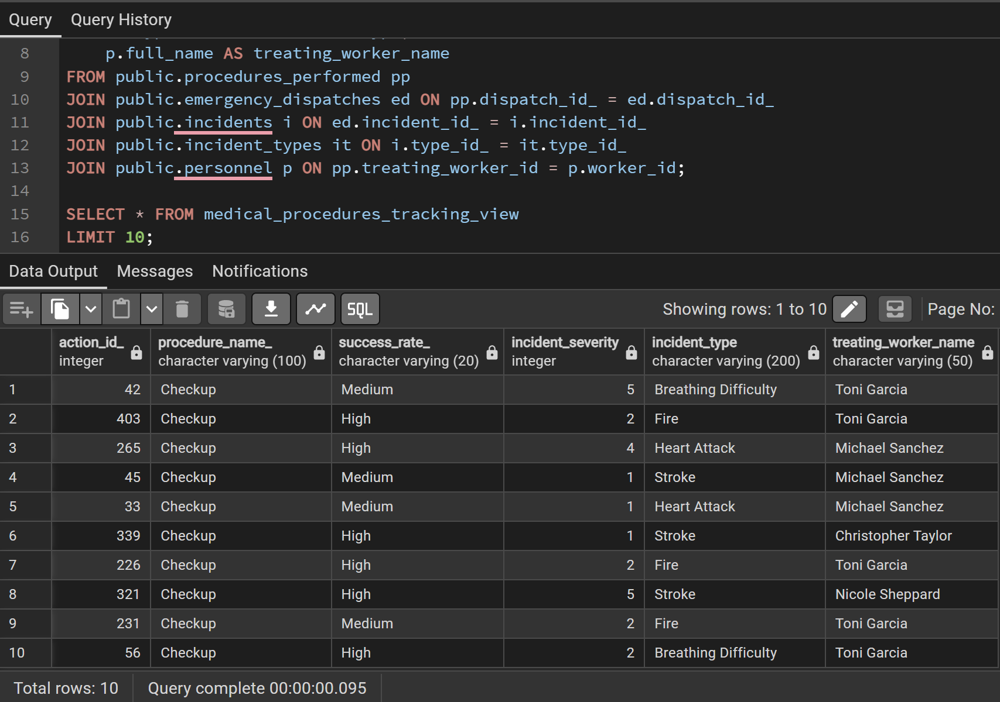

---

### מבט 3: אינטגרציית מערכות - המבט המשולב (`integrated_mission_log_view`)
**תיאור מילולי:** זהו המבט האינטגרטיבי המרכזי של הפרויקט, המהווה גשר ישיר בין האגף המבצעי לאגף הלוגיסטי. עבור כל נסיעת חירום, המבט שולף את זמן ההזנקה וחומרת האירוע, ומחבר אותם ישירות ללוחית הרישוי של הרכב, סוג האמבולנס, תחנת האם אליה הרכב שייך, ושמו המלא של הנהג שהוביל את המשימה.

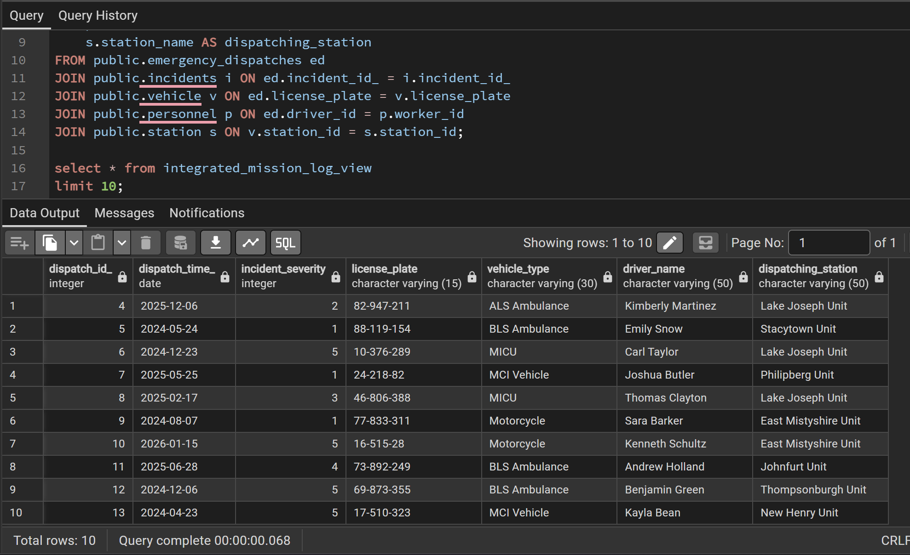

---

## 5. שאילתות משמעותיות על המבטים

### 5.1 שאילתות על מבט משאבי אנוש ולוגיסטיקה

#### שאילתא א': התפלגות כוח אדם בתחנות
**תיאור מילולי:** שאילתא ניהולית המציגה את התפלגות התפקידים בארגון. היא מקבצת את הנתונים לפי תחנה ולפי סוג העובד, וסופרת כמה נהגים וכמה מתנדבים רשומים ומסווגים בכל תחנה.

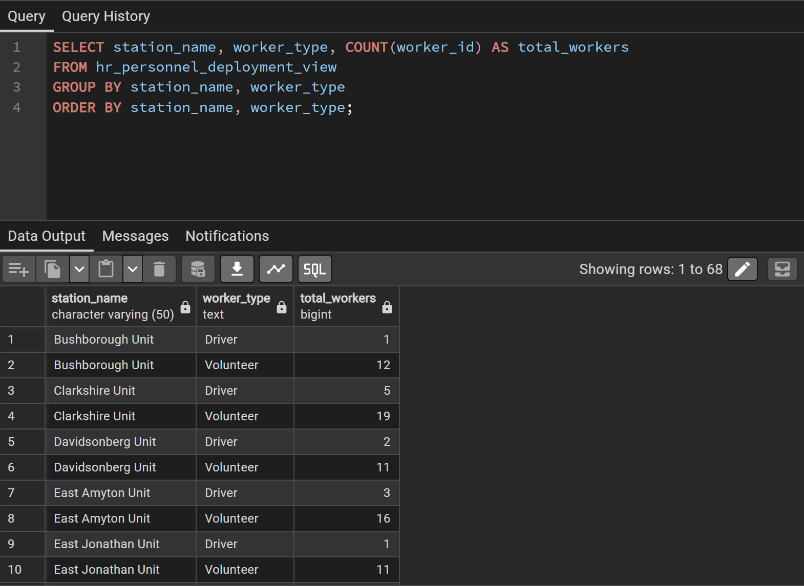

#### שאילתא ב': יומן כוננות נהגים מרחבי
**תיאור מילולי:** שליפת רשימת שמותיהם המלאים של כלל אנשי הצוות המוגדרים כנהגים ומשרתים בתחנות במחוז או בעיר ספציפית, לצורך שיבוץ משמרות זמין ויעיל.

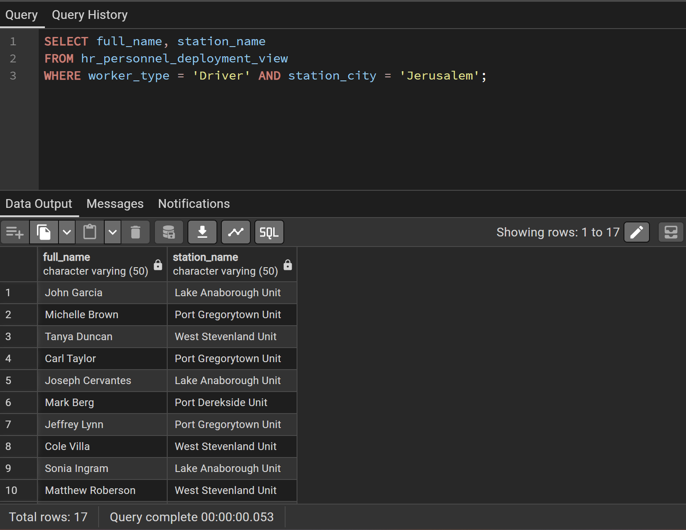

---

### 5.2 שאילתות על מבט מעקב פרוצדורות רפואיות

#### שאילתא א': בקרת מקרים קריטיים
**תיאור מילולי:** איתור וריכוז של כל הפעולות הרפואיות שבוצעו בשטח באירועים קריטיים במיוחד (דרגת חומרה 5). השאילתה מסדרת את הנתונים לפי רמת הצלחת הטיפול בסדר יורד, לשם ביצוע תחקיר אירוע והפקת לקחים רפואיים.

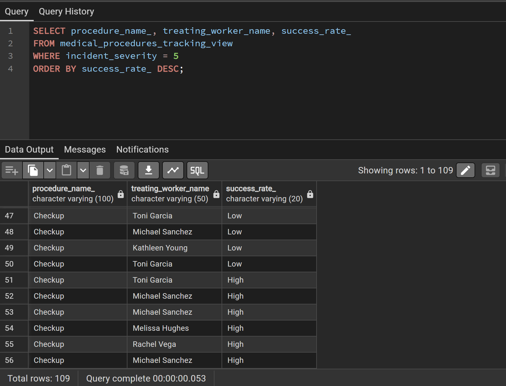

#### שאילתא ב': איתור אנשי צוות פעילים
**תיאור מילולי:** שאילתת אופטימיזציה המזהה מיהם חמשת אנשי הצוות (נהגים או מתנדבים) הפעילים ביותר בשטח, אשר ביצעו בפועל את כמות הפרוצדורות הרפואיות הגבוהה ביותר מתוך סך כלל האירועים.

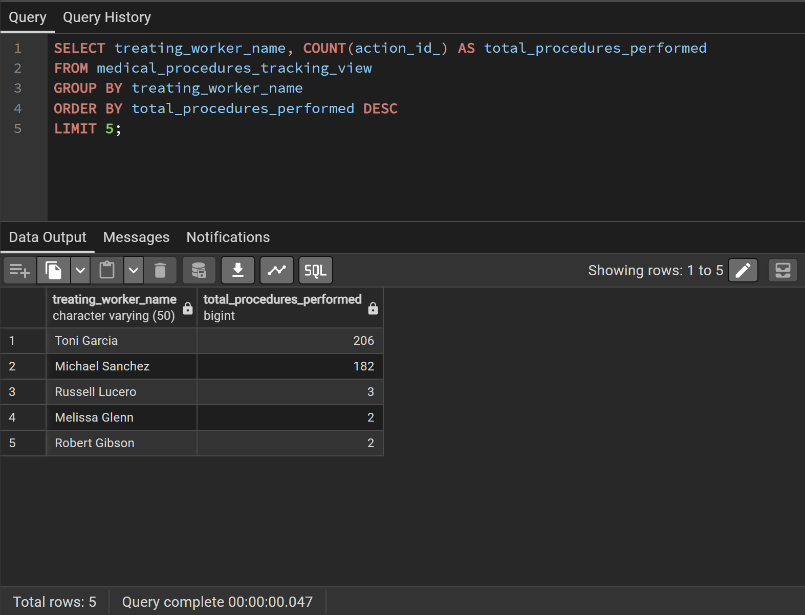

---

### 5.3 שאילתות על המבט המשולב

#### שאילתא א': יומן פעילות כלי רכב
**תיאור מילולי:** הפקת דוח היסטורי ומלא עבור אמבולנס ספציפי המציג מתי הוא הוזנק לאירוע, מה הייתה חומרת המקרה, ומי הנהג שפיקד על הרכב באותה נסיעה. מיועד למעקב קילומטראז' מבצעי וטיפולים מונעים של הצי.

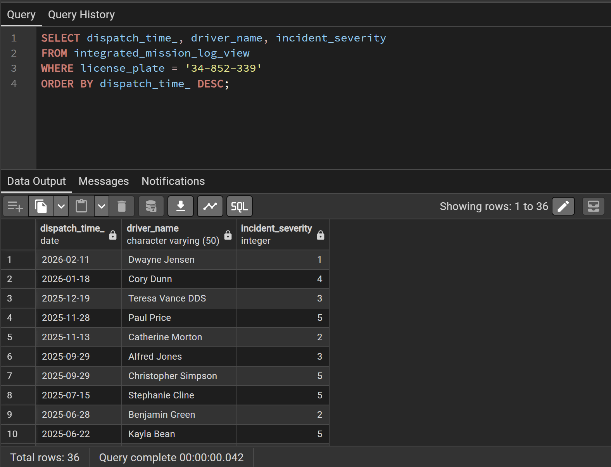

#### שאילתא ב': ניתוח עומסי חירום למרחב
**תיאור מילולי:** שאילתת אסטרטגיה המדרגת את כמות אירועי החירום הקשים (חומרה 4 ו-5) שהוזנקו מכל תחנה לוגיסטית, במטרה לאתר נקודות פריסה הדורשות תגבור עתידי של ניידות טיפול נמרץ (נט"ן).

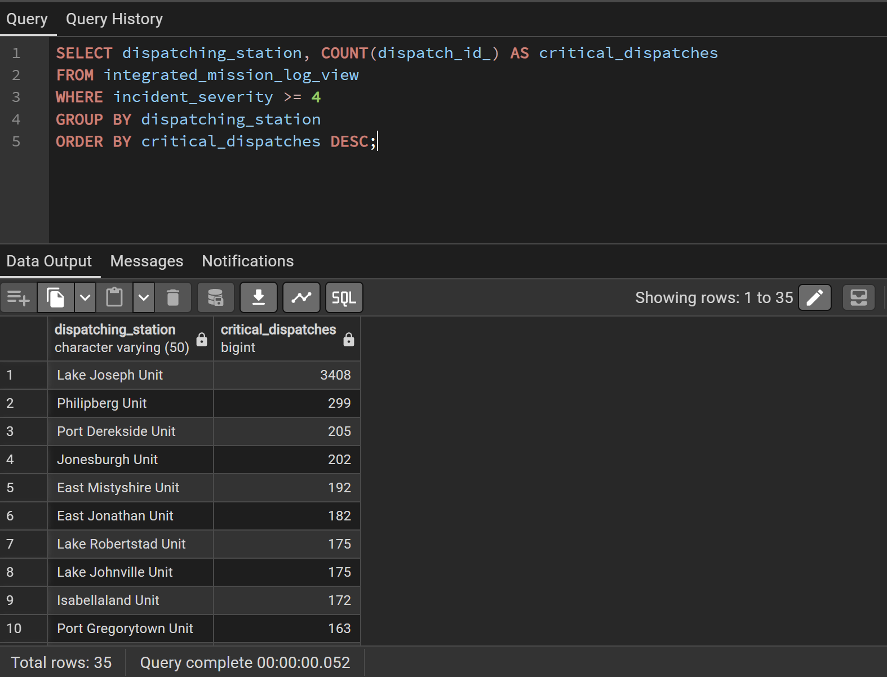

