# Database Project

**Submitted by:** Harel Gabay  
**Subject:** MDA Logistics 

---

## Table of Contents
1. [Phase 1](#phase-1)
   * [Project Overview](#project-overview)
   * [Google Ai Studio](#google-ai-studio)
   * [Entity Relationship Diagram (ERD)](#entity-relationship-diagram-erd)
   * [Data Structure Diagram (DSD)](#data-structure-diagram-dsd)
   * [SQL Scripts](#sql-scripts)
   * [Data Insertion](#data-insertion)
   * [Backup Process](#backup-process)
2. [Phase 2](#phase-2)

---

## Phase 1

### Project Overview
The project manages the complex logistics of an MDA organization, focusing on operational readiness—tracking stations, personnel, fleet maintenance, and inventory without handling private medical records.

#### Purpose of the Database
The primary goals of this project are:
* **Database Design**: Creating a well-structured relational database normalized to 3NF.
* **Efficient Data Storage**: Organizing data to allow quick retrieval and manipulation.
* **Data Integrity and Consistency**: Implementing constraints (PK, FK, Check) to maintain valid data.
* **Backup and Recovery**: Ensuring that data is not lost and can be restored when needed.

#### Key Functionalities
* **Data storage and retrieval** using advanced SQL queries.
* **Relationships between tables** ensuring logical connections and referential integrity.
* **Simulating real-world scenarios** where database management is crucial for life-saving logistics.
* **Automation of data entry** using external Python scripts and bulk injection tools.

### Google Ai Studio
* **Live Website:** [MDA Logistics](https://ems-logistics-pro-505350528104.us-west1.run.app/)

1. **Main Dashboard**: Overview of active vehicles and logistical activities. 
2. **Inventory & Procurement**: Management of station inventory and purchase orders. 
3. **Fleet Management**: Tracking of ambulance fleet details and garage logs. 
4. **Compliance & Tracking**: Sensitive tracking for equipment calibration and substances. 
5. **Personnel & Gear**: Directory of medical staff and gear logs. 

### Entity Relationship Diagram (ERD)
The conceptual data model mapping out 12 core entities and their relationships.

### Data Structure Diagram (DSD)
The logical database schema normalized to **3NF**, including PK/FK mappings.

### SQL Scripts
**The following SQL scripts are included in the repository:**

* **Create Tables:** Defines the database schema.
* [📜 View](./Phase_1/Sql_commands/createTables.sql)
* **Insert Data:** Populates the tables with sample data.
* [📜 View](./Phase_1/Sql_commands/insertTables.sql)
* **Drop Tables:** Removes all tables from the database.
* [📜 View](./Phase_1/Sql_commands/dropTables.sql)
* **Select All Data:** Retrieves all data from the tables.
* [📜 View](./Phase_1/Sql_commands/selectAll.sql)

### Data Insertion

#### 1. Phase A: Manual Baseline
Small-scale, high-quality manual insertions were performed to verify schema constraints and relationship integrity.
* **File:** [insertTables.sql](./Phase_1/sql_commands/insertTables.sql)

#### 2. Phase B: Institutional Scaling (500+ Records)
To reach a realistic scale for a national EMS organization, a Python-based generator was developed using the **Faker** library. This phase populated 9 core tables with over **500 records each**.
* **Methodology**: Uses an idempotent approach with `ON CONFLICT DO NOTHING` to allow repeatable generation without collisions.
* **Script:** [generate_sql.py](./Phase_1/Programming/generate_sql.py)

#### 3. Phase C: Bulk Injection (40,000+ Records)
Simulating years of operational history, we injected **20,000 records each** into `Maintenance_Log` and `Controlled_Substances_Log`.
* **Mock Data Generation (Mockaroo)**: Used to generate random CSV files for data insertion.
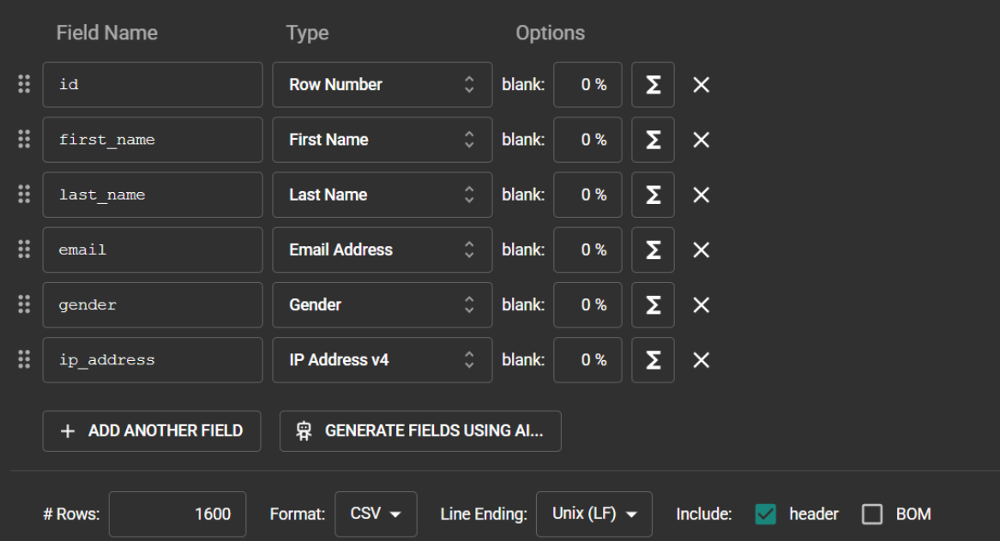
* **Bulk Loading**: Utilizes the PostgreSQL **COPY** command for high-speed injection, bypassing standard INSERT overhead.
* **Script:** [insert_to_db.py](./Phase_1/mockarooFiles/insert_to_db.py)

Final state of tables:
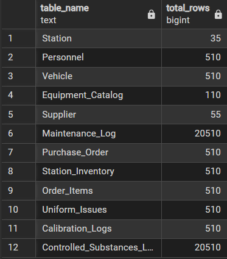

### Backup Process
The backup was generated using the **pgAdmin 4** management interface. We fully restored it on a fresh container to ensure data portability.

* **File:** [backup_23_03_2026.sql](./Phase_1/backup_23_03_2026.sql)

---

## **Phase 2**
### Queries
#### Select Queries:
**1. ספקים שלא ביצעו הזמנות משנת 2025**
הסבר יעילות: תצורה 1 (NOT EXISTS) מומלצת כי היא עוצרת מיד כשנמצאת התאמה. תצורה 2 (LEFT JOIN) מאלצת לבצע חיבור מלא של הטבלאות בזיכרון ורק אז מסננת ערכי NULL.
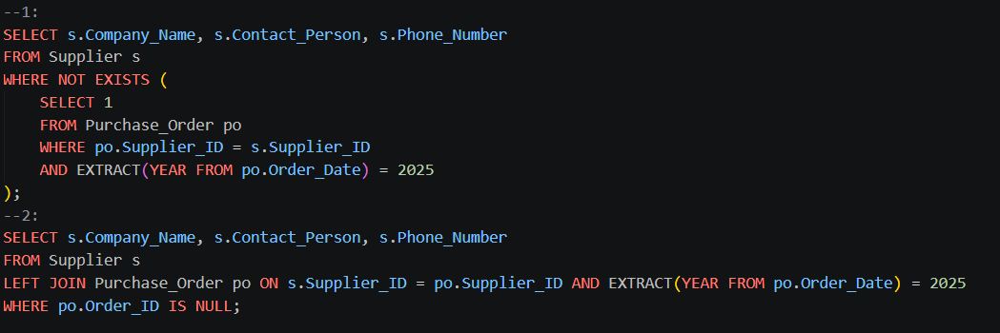

**2. עובדים שמשכו חומרים נרקוטים בחודש נובמבר 2025**
הסבר יעילות: תצורה 1 (IN) עדיפה כי היא בודקת רק קיום של רשומה. תצורה 2 (JOIN) משכפלת רשומות ומאלצת שימוש ב-DISTINCT, המצריך פעולת מיון (Sort) שגוזלת משאבים רבים.
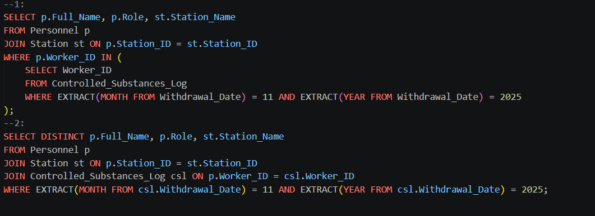
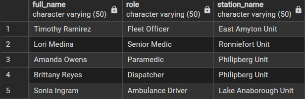

**3. פריטי ציוד רפואי שהכמות שלהם במלאי קטנה מ-10**
הסבר יעילות: תצורה 1 (JOIN) הרבה יותר יעילה. תצורה 2 מריצה תתי-שאילתות בשורת ה-SELECT עבור כל שורה שמוחזרת (בעיית N+1), מה שמאט מאוד את זמן הריצה.
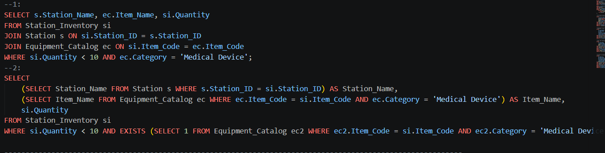
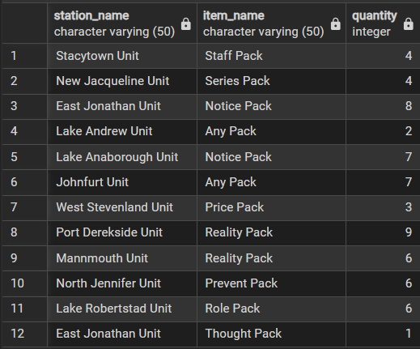

**4. רכבים שעלות הטיפולים שלהם גבוהה מהממוצע הארצי**
הסבר יעילות: תצורה 1 (WITH - CTE) מחשבת את הממוצע הארצי פעם אחת בלבד ושומרת אותו בזיכרון. לכן היא קריאה ויעילה יותר לעומת תצורה 2 שמחשבת זאת מחדש בתוך ה-HAVING.
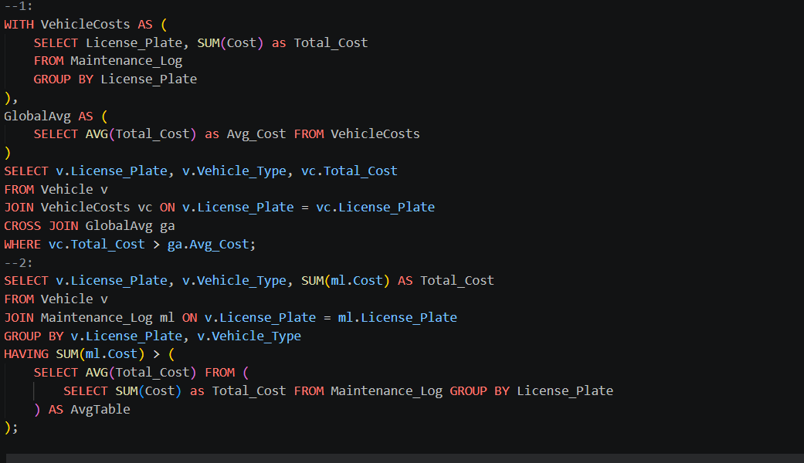
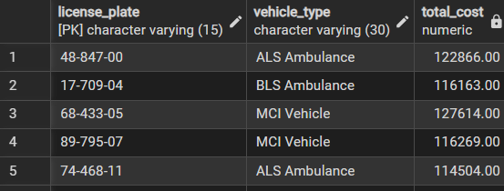

**5. דוח עלויות טיפולי מוסך מקובץ לפי תחנה וחודש**
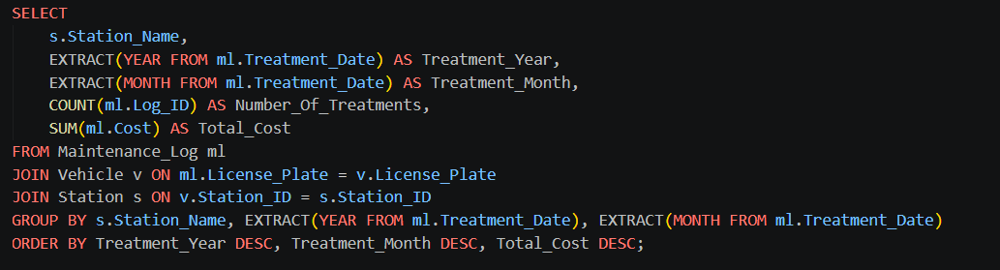
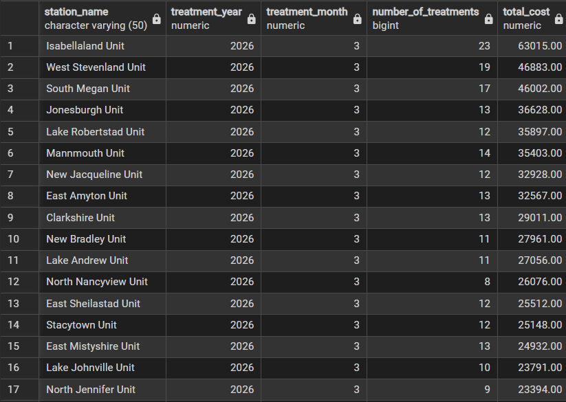

**6. היסטוריית חלוקת מדים - מנפק מול מקבל**
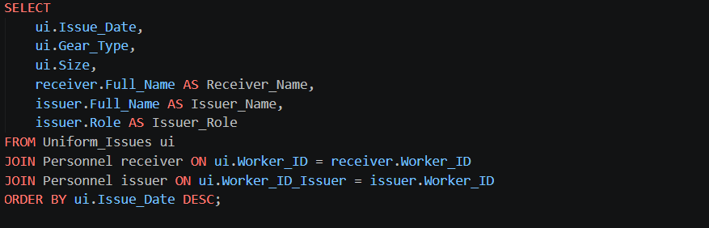
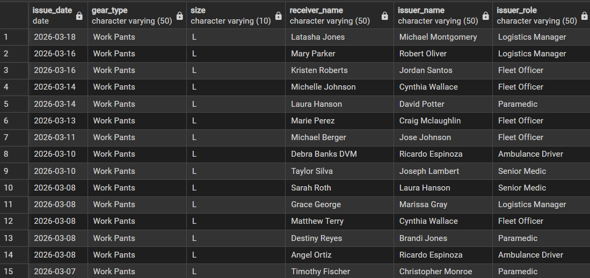

**7. ציוד כיול שחזר עם סטטוס כשלון, מספר כישלונות, ותאריך אחרון לפי תחנה**
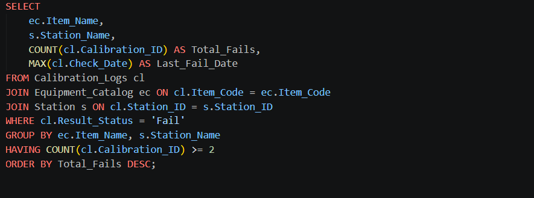
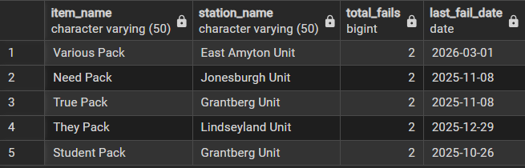

**8. הזמנות רכש פתוחות טרם סופקו וכמות הפריטים שהוזמנה**
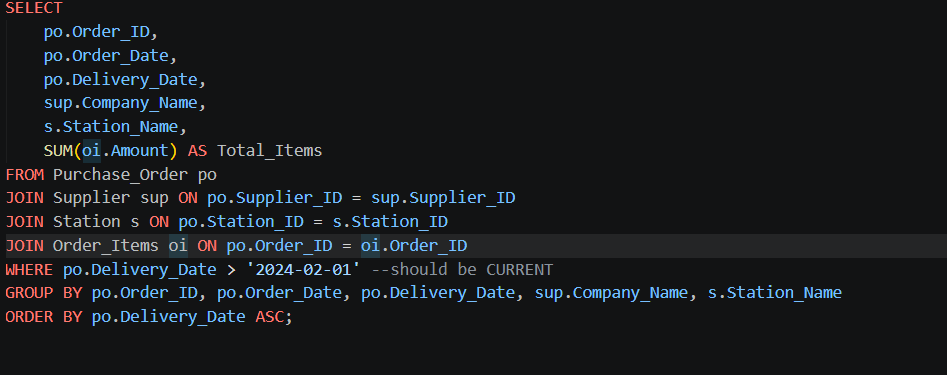
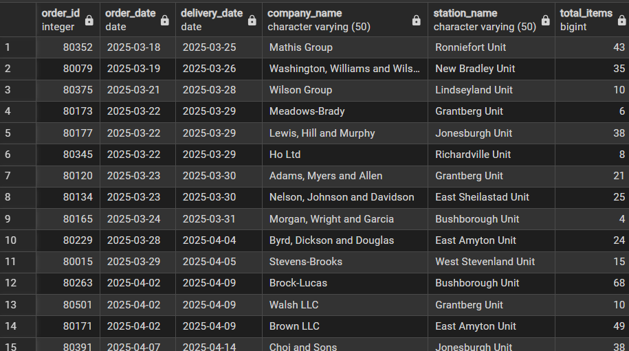
